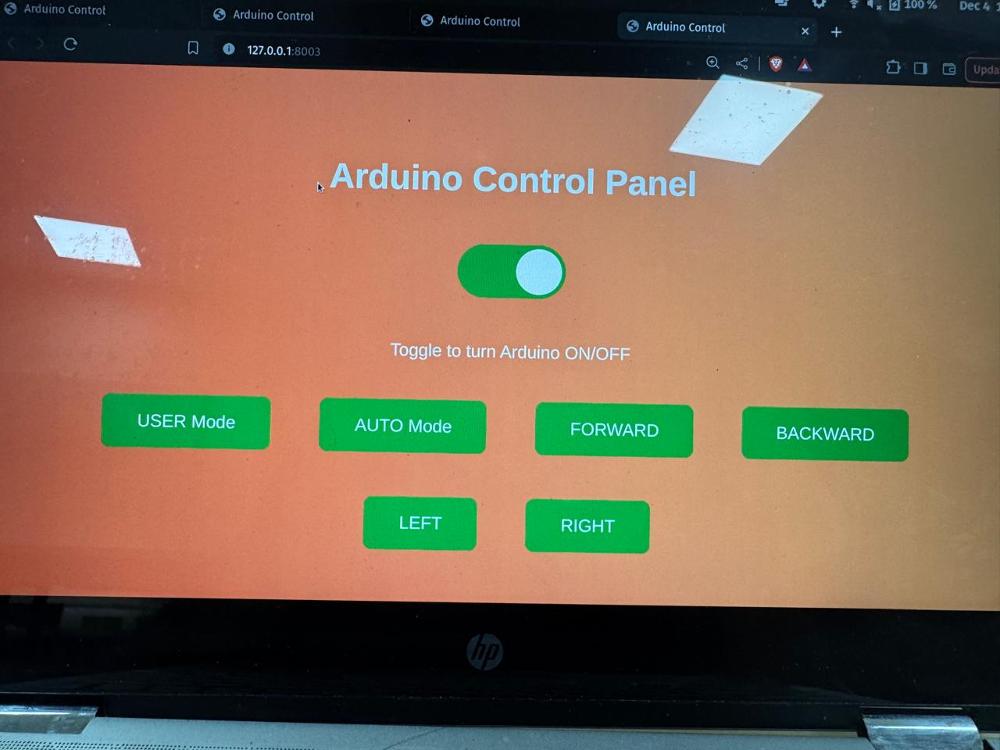
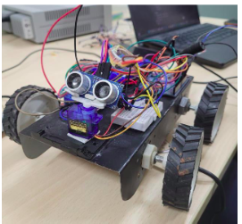

# 🤖 Object Avoidance Robot with Dual Control Modes and Data Analysis

## 🌟 Overview
This project features an object avoidance robot built using the Arduino IDE, designed to navigate its environment while avoiding obstacles. The robot is equipped with DC motors for movement and a servo motor with a mounted ultrasonic sensor for obstacle detection. It supports two operational modes: automatic and user-controlled. Additionally, the robot transmits its direction and ultrasonic sensor readings to the ThinkSpeak platform for data analysis and visualization.It uses serial communication to enable different modes for user control.

## 🚀 Features
- **🧠 Object Avoidance:** Uses an ultrasonic sensor to detect and avoid obstacles.
- **🎮 Dual Control Modes:**
  - **🤖 Automatic Mode:** The robot navigates autonomously, avoiding obstacles without user input.
  - **🕹️ User-Controlled Mode:** The user can manually control the robot’s movement.
- **📊 Real-Time Data Analysis:** Direction and ultrasonic readings are sent to ThinkSpeak for monitoring and analysis.

## 🛠️ Components Used
- 🧑‍💻 Arduino microcontroller
- ⚡ DC motors with motor driver
- 🌀 Servo motor
- 🌐 Ultrasonic sensor (HC-SR04)
- 🔋 Power supply (batteries or DC power suppply)
- 🚗 Chassis and wheels

## 💻 Software and Tools
- 📝 Arduino IDE
- 📊 ThinkSpeak (for data visualization and analysis)
- 🌐 Custom control interface (optional)

## ⚙️ Working Principle
1. **🤖 Automatic Mode:**
   - Ultrasonic sensor continuously scans the environment.
   - When an obstacle is detected within a certain distance, the robot changes direction to avoid it.
   - Servo motor adjusts the sensor’s position for better obstacle detection.

2. **🕹️ User-Controlled Mode:**
   - Commands are sent via a remote control interface (Bluetooth/Wi-Fi) to control the robot’s movement.
   - Ultrasonic sensor provides real-time feedback on the surroundings.

3. **📡 Data Transmission and Analysis:**
   - Directional commands and ultrasonic readings are sent to ThinkSpeak.
   - Data is visualized in real-time for analysis and performance evaluation.

## 🖥️ User Interface

## 📈 Data Analysis

## 🛠️ Setup and Installation
1. Assemble the robot and connect all components.
2. Upload the Arduino sketch via the Arduino IDE.
3. Connect the robot to the ThinkSpeak platform using the python code.
4. Configure control interface for user-controlled mode.

## 🌐 Real-Life Applications
- **🏠 Home Automation:** Autonomous cleaning robots and smart home devices.
- **🚗 Automotive:** Collision avoidance systems in self-driving cars.
- **🏭 Industrial Automation:** Automated guided vehicles in warehouses.
- **🧑‍🚀 Exploration:** Robots used for space exploration and remote environment mapping.
- **🚨 Security:** Surveillance and patrolling robots.

## 🔮 Future Enhancements
- 📱 Integration with mobile apps for easier control.
- 🧠 Real time direction map and enable the automated movement,following a given path.
- 🧑‍💻 Adding microphone to enable inputs from users by voice only in different languages.

## 📝 Conclusion
This object avoidance robot demonstrates a versatile approach to autonomous and manual navigation with real-time data analysis capabilities. The use of ThinkSpeak enhances the robot’s functionality by providing insightful performance metrics and visualizations.

